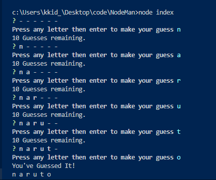
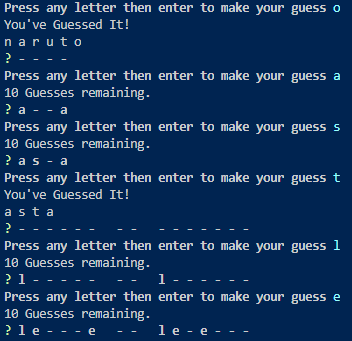
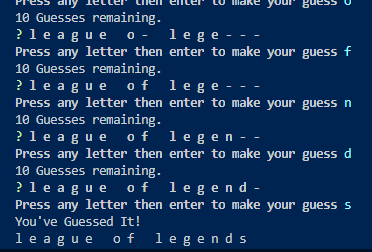
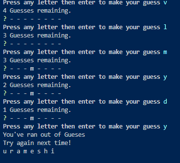
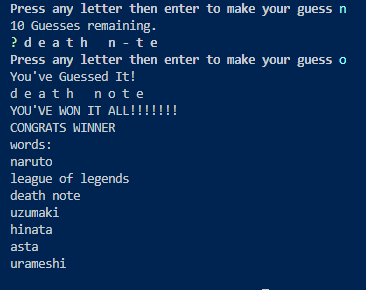

# NodeMan
Hangman node style!

## Index
[Process](#Process)

[Issues](#Issues)

[Screenshots](#Screenshots)

### Process
I started with the initial letters.js constructor.
Using `this` and `return` for the structure and output since I knew `inquirer` would output the returned values. 
Once I ran a couple tests making sure it worked when provided a letter I tested the `require('./letter.js')`.  [first Issue](#Issues)
On to the word.js, this is mainly for loops and `push()` into arrays.
I initiated every function one at a time testing with `console.log()`.
On to the index.js, this took the most time.
Mainly because I wanted random words to be guessed and guesses remaining to log after every guess.
Mainly `if` statements and conditionals.
[Second Issue](#Issues)

### Issues
1. 
I initially ran into an issue with the exporting of the constructor because I wrote the function as a normal function while testing it in html inspect tool. (didn't have my computer, wrote the code in NotePad)
I had to review and fix my code making it a constructor instead of a function
```js
var Letter = function (letter) {
    //construct;
};
```
2. 
I ran into a couple issues with `splice()`.
I thought it removed one item from the index but after further research it removes all items after the given index if unspecified. 
```js
rando = Math.floor(Math.random() * words.length);
guess = new Word(words[rando]);
words.splice(rando,1);
```
I was happy to find that a variable with a random number doesn't generate everytime its called; only initially at load or untill called agian.
This allowed me to splice the single word from the array everytime while still selecting a word at random from the array. 

### Screenshots








